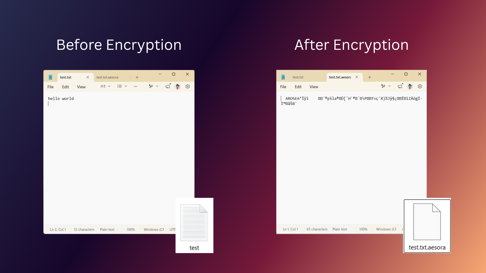

<div align="center">

# Aesora

## Secure File Encryption Tool

**Military-grade AES-256-GCM encryption with PBKDF2 key derivation for maximum file security**


[](https://en.cppreference.com/w/)
[](https://cmake.org/)
[](#-installation)

</div>

---

## Table of Contents

- [Overview](#overview)
- [Features](#features)
- [Tech Stack](#tech-stack)
- [Architecture & Workflow](#architecture--workflow)
- [Installation](#installation)
- [Usage](#usage)
- [Screenshots](#screenshots)
- [Project Structure](#project-structure)
- [Security Design](#security-design)
- [Future Improvements](#future-improvements)
- [Contributing](#contributing)
- [License](#license)
- [Author](#author)

---

## Overview

**Aesora** is a production-grade command-line file encryption tool built in modern C++17 that delivers military-grade protection for sensitive files. Using NIST-approved cryptographic algorithms, Aesora provides authenticated encryption that ensures both **confidentiality** and **integrity** of your data.

Whether you're protecting sensitive documents, archiving confidential information, or securing file transfers, Aesora combines ease of use with enterprise-level security standards.

**Core Technologies:** OpenSSL • AES-256-GCM • PBKDF2-HMAC-SHA256 • C++17

---

## Features

- **AES-256-GCM Authenticated Encryption** — NIST-approved encryption with built-in integrity verification, protecting both confidentiality and authenticity of files

- **PBKDF2-HMAC-SHA256 Key Derivation** — 310,000 iterations providing strong resistance against brute-force password attacks (~300ms per attempt)

- **Universal Binary-Safe Encryption** — Securely encrypts any file type: documents, images, archives, databases, executables, and more

- **Secure Password Handling** — Passwords are never exposed in process listings, environment variables, or shell history

- **Integrity Verification** — 16-byte GCM authentication tag detects any tampering, corruption, or unauthorized file modification

- **Cross-Platform Compatibility** — Seamless operation on Windows, macOS, and Linux with consistent command-line interface

- **Portable Static Builds** — Optional fully-static executable compilation for maximum portability and minimal dependencies

- **Cryptographically Secure Randomness** — OS-level entropy pool integration for robust salt and IV generation

---

## Tech Stack

### Languages & Standards
- **C++17** — Modern C++ with standard library support
- **CMake 3.12+** — Cross-platform build system

### Cryptography & Security
- **OpenSSL** — Industry-standard cryptographic library
- **AES-256-GCM** — Advanced Encryption Standard with Galois/Counter Mode
- **PBKDF2** — Password-Based Key Derivation Function 2
- **HMAC-SHA256** — Keyed-hash message authentication code

### Development & Testing
- **C++ Standard Library** — Portable, standard-compliant implementation
- **Testing Framework** — Comprehensive unit test suite

---

## Architecture & Workflow

Aesora employs a modular, layered architecture that separates concerns across cryptographic operations, file I/O, and orchestration logic:

### System Design

```
┌─────────────────────────────────────────────────────────┐
│           Command-Line Interface (main.cpp)             │
│          Password Handling & User Interaction           │
└──────────────────┬──────────────────────────────────────┘
                   │
        ┌──────────┴──────────┐
        │                     │
┌───────▼──────┐    ┌─────────▼───────┐
│  Encryption  │    │  Decryption     │
│ Orchestration│    │ Orchestration   │
└───────┬──────┘    └─────────┬───────┘
        │                     │
        └──────────┬──────────┘
                   │
     ┌─────────────┴──────────────┐
     │                            │
┌────▼─────────────┐   ┌──────────▼────────┐
│   Crypto Utils   │   │    File Utils     │
│  (Encryption &   │   │  (Binary-Safe I/O │
│  Key Derivation) │   │  & File Handling) │
└──────────────────┘   └───────────────────┘
     │                            │
     └─────────────┬──────────────┘
                   │
          ┌────────▼─────────┐
          │   OpenSSL        │
          │   (libssl)       │
          └──────────────────┘
```

### Encryption Workflow

1. **Password Input** → Secure password entry (no terminal echo)
2. **Salt Generation** → 16 random bytes from cryptographically secure RNG
3. **Key Derivation** → PBKDF2-HMAC-SHA256 with 310,000 iterations
4. **IV Generation** → 12 random bytes for GCM mode
5. **File Encryption** → AES-256-GCM encryption of plaintext
6. **Authentication Tag** → 16-byte GCM tag for integrity verification
7. **File Writing** → Atomic write of encrypted binary data with metadata

### File Format Specification

Aesora encrypted files follow a fixed binary structure for maximum compatibility and security:

```
┌──────────────────────────────────────────────────┐
│ Offset │ Size  │ Field              │ Content    │
├────────┼───────┼────────────────────┼────────────┤
│   0    │  8    │ Magic Header       │ "AESORA\0" │
│   8    │ 16    │ Salt               │ Random     │
│  24    │ 12    │ IV                 │ Random     │
│  36    │  *    │ Encrypted Data     │ Ciphertext │
│  36+*  │ 16    │ GCM Tag            │ Auth Tag   │
└──────────────────────────────────────────────────┘

Minimum encrypted file size: 52 bytes (empty plaintext)
```

---

## Installation

### Prerequisites

| Requirement | Minimum Version | Installation |
|-------------|-----------------|--------------|
| C++ Compiler | C++17 support | GCC 7+, Clang 5+, MSVC 2017+ |
| CMake | 3.12 or higher | https://cmake.org/download/ |
| OpenSSL | 1.1.0 or higher | See platform-specific instructions below |

### Platform-Specific Setup

<details>
<summary><b>Ubuntu / Debian Linux</b></summary>

```bash
# Install OpenSSL development libraries
sudo apt-get update
sudo apt-get install -y libssl-dev cmake build-essential

# Clone and build Aesora
git clone https://github.com/Tanmay-Bhatnagar22/Aesora.git
cd Aesora
mkdir build && cd build
cmake ..
make -j$(nproc)

# Run tests (optional)
ctest --output-on-failure

# Install (optional)
sudo make install
```

</details>

<details>
<summary><b>macOS</b></summary>

```bash
# Install Homebrew (if not already installed)
/bin/bash -c "$(curl -fsSL https://raw.githubusercontent.com/Homebrew/install/HEAD/install.sh)"

# Install dependencies
brew install openssl cmake

# Clone and build Aesora
git clone https://github.com/Tanmay-Bhatnagar22/Aesora.git
cd Aesora
mkdir build && cd build
cmake -DOPENSSL_DIR=$(brew --prefix openssl) ..
make -j$(sysctl -n hw.logicalcpu)

# Run tests (optional)
ctest --output-on-failure
```

</details>

<details>
<summary><b>Windows (MSVC)</b></summary>

```bash
# Option 1: Using vcpkg (Recommended)
vcpkg install openssl:x64-windows cmake

# Clone and build Aesora
git clone https://github.com/Tanmay-Bhatnagar22/Aesora.git
cd Aesora
mkdir build && cd build
cmake -DCMAKE_TOOLCHAIN_FILE="[vcpkg root]\scripts\buildsystems\vcpkg.cmake" ..
cmake --build . --config Release

# Option 2: Manual OpenSSL installation
# Download from: https://slproweb.com/products/Win32OpenSSL.html
# Then configure CMake with OPENSSL_DIR path
```

</details>

<details>
<summary><b>Static Build (All Platforms)</b></summary>

For a fully portable static executable without runtime dependencies:

```bash
mkdir build && cd build
cmake -DBUILD_STATIC_EXECUTABLE=ON ..
make
# Resulting binary can be used on any system without OpenSSL installation
```

</details>

### Verification

After building, verify the installation:

```bash
./aesora --help
# Output: Aesora - Secure File Encryption Tool
```

---

## Usage

### Basic Commands

#### Encrypt a File

```bash
./aesora encrypt <input_file> <output_file>
```

**Example:**
```bash
./aesora encrypt confidential_report.pdf confidential_report.pdf.aesora
# Enter password: ••••••••••
# ✓ Encryption successful
```

#### Decrypt a File

```bash
./aesora decrypt <encrypted_file> <output_file>
```

**Example:**
```bash
./aesora decrypt confidential_report.pdf.aesora confidential_report.pdf
# Enter password: ••••••••••
# ✓ Decryption successful
```

### Advanced Usage

#### Encrypt Multiple Files

```bash
# Using shell globbing
for file in *.pdf; do
    ./aesora encrypt "$file" "$file.aesora"
done
```

#### Create Encrypted Archives

```bash
# Compress and encrypt
tar czf - sensitive_folder | ./aesora encrypt /dev/stdin sensitive_folder.tar.gz.aesora

# Decrypt and extract
./aesora decrypt sensitive_folder.tar.gz.aesora /dev/stdout | tar xzf -
```

### Password Guidelines

- **Minimum:** 8 characters (recommended: 12+)
- **Complexity:** Mix uppercase, lowercase, numbers, and special characters
- **Storage:** Keep passwords secure; Aesora cannot recover lost passwords
- **Backup:** Consider secure password manager integration for critical files

---

## Screenshots

### Encryption in Action

<!-- Screenshot placeholder: Show terminal with encryption command and success message -->


### Decryption Verification

<!-- Screenshot placeholder: Show terminal with decryption command and file integrity confirmation -->


### File Comparison (Before & After)

<!-- Screenshot placeholder: Show file size comparison between plaintext and encrypted versions -->





---

## Project Structure

```
Aesora/
├── CMakeLists.txt                    # CMake build configuration
├── README.md                         # This file
├── LICENSE                           # MIT License
│
├── include/                          # Header files
│   ├── crypto_utils.h                # Cryptographic operations
│   ├── encrypt.h                     # Encryption interface
│   ├── decrypt.h                     # Decryption interface
│   ├── file_utils.h                  # File I/O utilities
│   └── terminal_colors.h             # CLI output formatting
│
├── src/                              # Implementation files
│   ├── main.cpp                      # CLI entry point
│   ├── crypto_utils.cpp              # OpenSSL wrapper implementations
│   ├── encrypt.cpp                   # Encryption logic
│   ├── decrypt.cpp                   # Decryption logic
│   └── file_utils.cpp                # File handling implementations
│
├── tests/                            # Test suite
│   └── test_aesora.cpp               # Comprehensive unit tests
│
├── assests/                          # Project assets
│   └── icon.rc                       # Windows resource file
│
├── installer/                        # Installation package
│   ├── installer.iss                 # InnoSetup configuration
│   └── installer_output/             # Built installers
│
└── build/                            # Build artifacts (generated)
    ├── aesora                        # Compiled executable (Linux/macOS)
    ├── aesora.exe                    # Compiled executable (Windows)
    └── CMakeFiles/                   # CMake configuration files
```

---

## Security Design

### Cryptographic Guarantees

| Component | Algorithm | Standard | Key Length | Iterations |
|-----------|-----------|----------|------------|------------|
| Encryption | AES-GCM | NIST FIPS 197 | 256-bit | 1 pass |
| Key Derivation | PBKDF2 | NIST SP 800-132 | 256-bit | 310,000 |
| Authentication | GCM Tag | NIST SP 800-38D | 128-bit | Built-in |
| Random Generation | /dev/urandom | OS-level | 64+ bits | Variable |

### Design Principles

- **Authenticated Encryption** — GCM mode provides both confidentiality and authenticity in a single operation
- **Salt-Based Key Derivation** — Unique 16-byte salt per file prevents rainbow table attacks
- **Modern IV Handling** — 96-bit IV for optimal GCM security and performance
- **No Padding Oracles** — GCM eliminates padding-based vulnerabilities
- **Hardware Acceleration** — OpenSSL utilizes AES-NI when available

### Threat Model

Aesora protects against:
- Unauthorized file access (encryption)
- Brute-force password attacks (PBKDF2 iteration count)
- File tampering (GCM authentication)
- Password recovery from memory (secure input handling)

### Known Limitations

- Password strength depends on user selection
- No key escrow or recovery mechanism
- Encrypted filenames not protected (consider using tar archives)
- No built-in key rotation (re-encrypt to update encryption)

---

## Future Improvements

- **Key Management System** — Support for encrypted key files and key derivation from certificates
- **Batch Operations** — Enhanced CLI with progress bars and batch file processing
- **GUI Application** — Cross-platform graphical interface using Qt or FLTK
- **Hardware Security Module (HSM) Integration** — Support for YubiKey and similar devices
- **Cloud Storage Integration** — Direct encryption/decryption for cloud services (AWS S3, Azure Blob, etc.)
- **Streaming Encryption** — Support for large files exceeding available RAM
- **Performance Optimization** — Parallel processing for multi-file operations
- **Metadata Encryption** — Protect file names and attributes within archives
- **Forensic Mode** — Advanced analysis and recovery options for encrypted files
- **WebAssembly Port** — Browser-based encryption for web applications

---

## Contributing

We welcome contributions from the community! Whether you're fixing bugs, adding features, or improving documentation, your help makes Aesora better.

### How to Contribute

1. **Fork the repository** on GitHub
2. **Create a feature branch:** `git checkout -b feature/your-feature`
3. **Make your changes** with clear, descriptive commits
4. **Test thoroughly:** Run the test suite with `ctest`
5. **Submit a pull request** with a detailed description of your changes

### Contribution Guidelines

- Follow the existing code style (C++17 modern practices)
- Add tests for new features
- Update documentation as needed
- Ensure all tests pass before submitting PR
- Provide clear commit messages

### Reporting Issues

Found a bug? Have a feature request? [Create an issue](https://github.com/Tanmay-Bhatnagar22/Aesora/issues) with:
- Clear description of the problem
- Steps to reproduce (if applicable)
- Expected vs. actual behavior
- Your environment (OS, compiler, OpenSSL version)

---

## License

Aesora is released under the **MIT License** — a permissive open-source license allowing commercial and private use with attribution.

See [LICENSE](LICENSE) file for complete license text.

---

## Author

**Developed by:** Tanmay Bhatnagar

### Connect

- **GitHub:** [@Tanmay-Bhatnagar22](https://github.com/Tanmay-Bhatnagar22)
- **LinkedIn:** [linkedin.com/in/tanmay-bhatnagar-vit/](https://www.linkedin.com/in/tanmay-bhatnagar-vit/)
- **Email:** [tanmaybhatnagar760@gmail.com](mailto:tanmaybhatnagar760@gmail.com)


---

<div align="center">

**Questions?** Open an issue or reach out directly.


</div>
